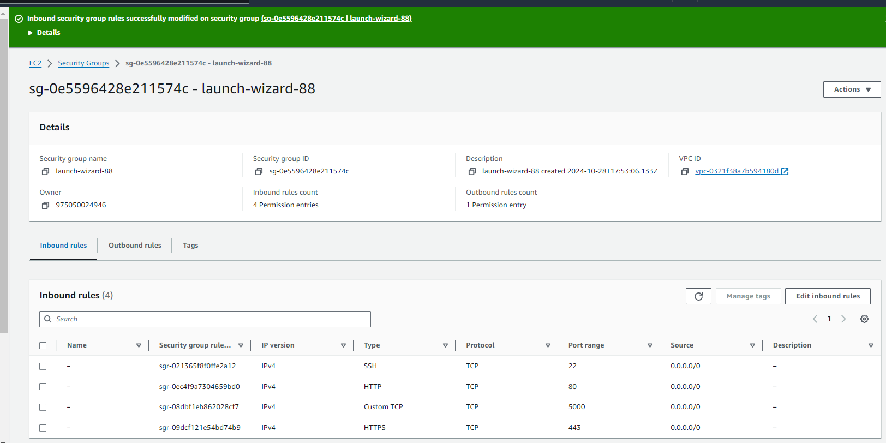
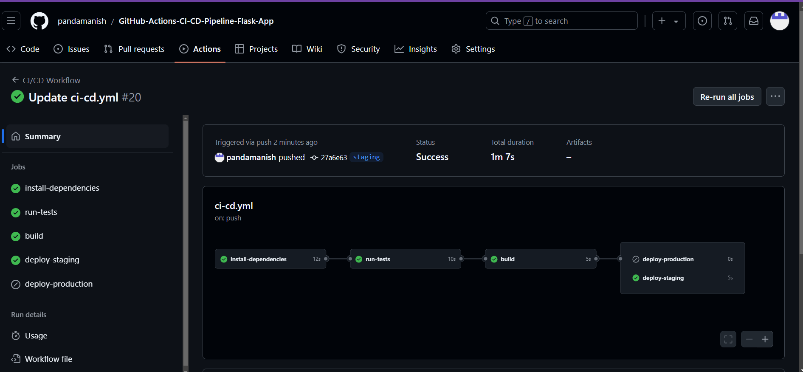
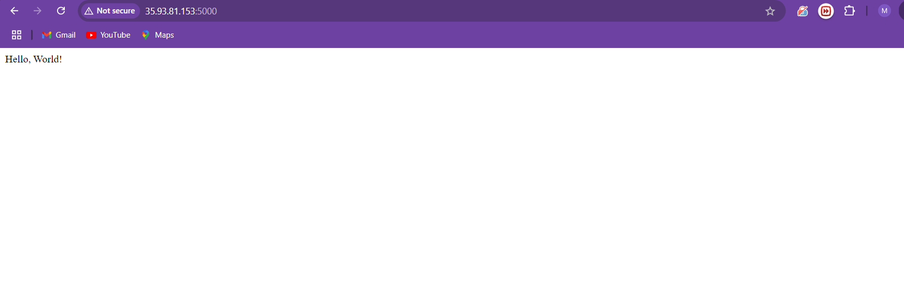

# GitHub-Actions-CI-CD-Pipeline-Flask-App
# Objective
This repository implements a CI/CD workflow using GitHub Actions for a Python web application. It automates the process of installing dependencies, running tests, and deploying to staging and production environments.

# Requirements
1. Created a EC2 Instance for deploying
    
2. Repository Setup
created my app.py in my repository.
 Ensured the repository has the following branches:
main
staging

3. GitHub Actions Workflow Setup
Created Workflow Directory:
Navigated to the main branch of my repository on GitHub.
Clicked on Add file > Created new file.
Named the file .github/workflows/ci-cd.yml.
Defined the Workflow in the yml file:

name: CI/CD Pipeline

on:
  push:
    branches:
      - staging
  release:
    types: [published]

jobs:
  install:
    runs-on: ubuntu-latest
    steps:
      - name: Checkout code
        uses: actions/checkout@v4

      - name: Set up Python
        uses: actions/setup-python@v4
        with:
          python-version: '3.12'

      - name: Install dependencies
        run: |
          python -m pip install --upgrade pip
          pip install -r requirements.txt

  test:
    runs-on: ubuntu-latest
    needs: install
    steps:
      - name: Checkout code
        uses: actions/checkout@v4

      - name: Run tests
        run: |
          python -m pytest tests/test_app.py

  build:
    runs-on: ubuntu-latest
    needs: test
    steps:
      - name: Checkout code
        uses: actions/checkout@v4

      - name: Build application
        run: |
          echo "Build process goes here"

  deploy_staging:
    runs-on: ubuntu-latest
    needs: build
    if: github.ref == 'refs/heads/staging'
    steps:
      - name: Checkout code
        uses: actions/checkout@v4

      - name: Deploy to Staging
        run: |
          echo "Deploying to staging environment"

  deploy_production:
    runs-on: ubuntu-latest
    needs: build
    if: startsWith(github.ref, 'refs/tags/')
    steps:
      - name: Checkout code
        uses: actions/checkout@v4

      - name: Deploy to Production
        run: |
          echo "Deploying to production environment"
 
4.Environment Secrets Stored Sensitive Information:
Gone to repository's Settings tab.
Scroll down to the Secrets and variables section, and select Actions.
Click on New repository secret to add EC2 SSH details there used for deployments.

# Testing

After a push to the repository or a pull request, checked the "Actions" tab on GitHub to see the results of the test runs. This will provide information on whether the tests passed or failed, along with logs detailing the test execution.

